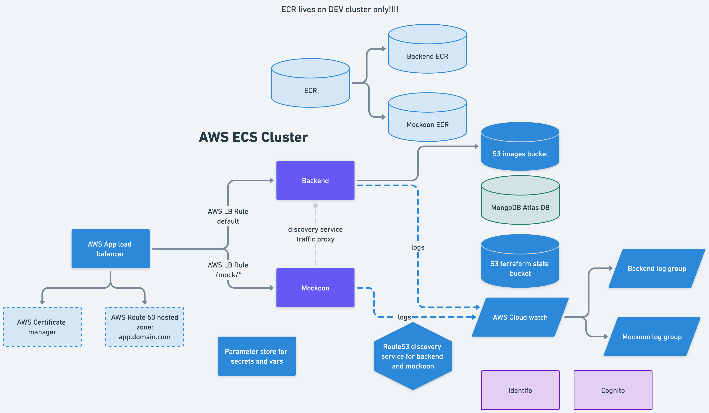

# Reference Cloud infrastructure (IaC)

This repository declares infrastructure of Gigit cloud as a code using [Terraform](https://www.terraform.io/).

## Dependencies

- Terraform v1.2.6: [how to install terraform](https://developer.hashicorp.com/terraform/tutorials/aws-get-started/install-cli).
- AWS credentials for accessing Terraform state (hosted in S3 bucket)
- gomplate, use your local dependency management system for it, for mac: `brew install gomplate`
- GNU Make (should be part of any system by default). Optional, you can run command from makefile directly in terminal.

0. Create a dedicated git repository for your project's infrastructure.

It is a good idea to keep a state of your current infrastructure in git. Because terraform is declarative approach, you can revert your infrastructure to any moment of the changes. 

Let's assume you have crated the repository for your project infrastructure and working from that:

```bash
git clone ssh@my_project_infrastructure
cd my_project_infrastructure

```


1. Copy two file to your root repo location:

```bash
    curl https://raw.githubusercontent.com/MadAppGang/infrastructure/main/project/Makefile -o Makefile
    curl https://raw.githubusercontent.com/MadAppGang/infrastructure/main/project/dev.yaml -o dev.yaml
```

***Do not clone this repository, you don't need it!*** We assume that you are located in the empty repo of your project's infrastructure or you can do it in a subfolder inside your project.

As a result you will 

2. Init new data:
   
```bash
    make init
```
   

3. Edit `dev.yaml` file and run generate your terraform data:

```bash
    make dev
```

or 

```sh
    gomplate -c vars=dev.yaml -f ./infrastructure/env/main.tmpl   -o ./env/dev/main.tf
```

If you set up on a new AWS account, you need to create state bucket first:

```bash
export AWS_PROFILE=projectdev
aws s3 mb s3://instagram-terraform-state-dev
```

4. Init Terraform:

Wnsure uou are using the proper AWS_PROFILE first.

```bash
    export AWS_PROFILE=projectdev
    make devplan
```

or

```sh
    cd env/dev
    terraform init
```

5. Apply the plan when you're happy with it:


```bash
    make devapply
```

or

```bash
    terraform apply
```

6. After that commit this repo and ideally you don't need it any more.
   
You can find an examples of docker files, and github actions for different tech stacks in `receipts` folder.

Whenever you publish new ECR (using github action or manually) the watcher in the cloud will redeploy your infrastructure.

In production you need to send special command to AWS event bridge. Just explicit deploys to prod allowed. If you want to automate it - add this to your github action or other CI.

7. Whenever you make a change to your configuration, `dev.yaml` or  `prod.yaml` you need to update it.

```bash
make dev
make devplan
.........
terraform change output here
ensure terraform performs what you expected
.......
make devapply
```

8. update your infrastructure

You can check infrastructure version by typing `make version`. If new version available with new features you need, you need to update your reference architecture files.

```bash
make update
make dev
make devapply
```

Don't upgrade if you don't have too. We are trying to keep backward compatibility, but it is not guaranteed. 

## Makefile commands

| command | description |
| ---- | ------ |
| clean | remove all the data |
| update | apply new version of infrastructure |
| version | show current infrastructure version |
| dev | generate dev terraform env |
| prod | generate prod terraform env |
| devplan | show dev terraform plan |
| prodplan | show prod terraform plan |
| devapply | apply dev terraform plan | 
| prodapply | apply prod terraform plan |

## Env variables management
Backend, and every task are using env variables from AWS Parameter Store (SMM). One parameter store per value.

When you need to populate initial values from JSON file, please use 


## Architecture




## Health check

All services by default should respond status `200` on GET handler with path `/health/live`. If it is not responding with status 200, the application load balancer will consider the service unhealthy and redeploy it. 


## Remote debug

[You can use Amazon ECS Exec](https://docs.aws.amazon.com/AmazonECS/latest/developerguide/ecs-exec.html) to  execute command remotely in terminal.

To do so, you need to install [AWS Session Management Plugin](https://docs.aws.amazon.com/systems-manager/latest/userguide/session-manager-working-with-install-plugin.html#install-plugin-macos) on your machine.

For mac Mx you  need:

```shell
curl "https://s3.amazonaws.com/session-manager-downloads/plugin/latest/mac_arm64/session-manager-plugin.pkg" -o "session-manager-plugin.pkg"
sudo installer -pkg session-manager-plugin.pkg -target /
sudo ln -s /usr/local/sessionmanagerplugin/bin/session-manager-plugin /usr/local/bin/session-manager-plugin

```

After that you can verify the installation: `session-manager-plugin`.

With session manager you can login to container, execut a command in container or do a port forwarding.

You can use a [usefull script](https://github.com/aws-containers/amazon-ecs-exec-checker) to help you work with AWS Exec.


## Send events to Event Bridge 

You can test events by sending them event bus using CLI. The same command is used to send it ot deploy from Github Aciton.

```bash
aws events put-events --entries "Source=github,Detail=\"{}\",DetailType=TESTING,EventBusName=default"
```