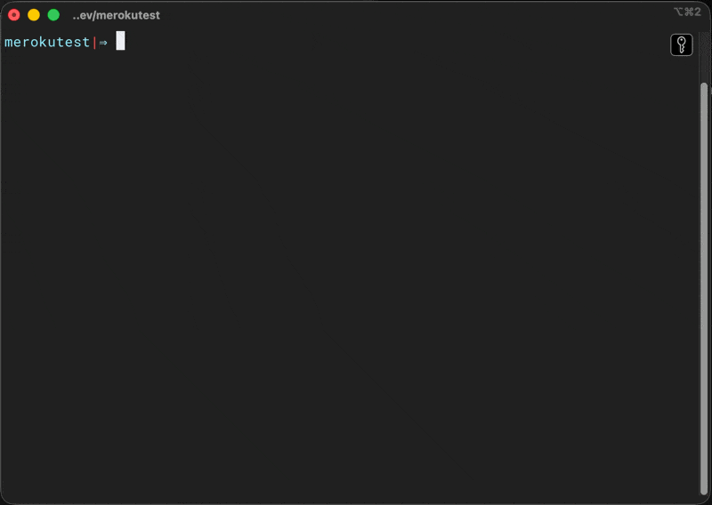
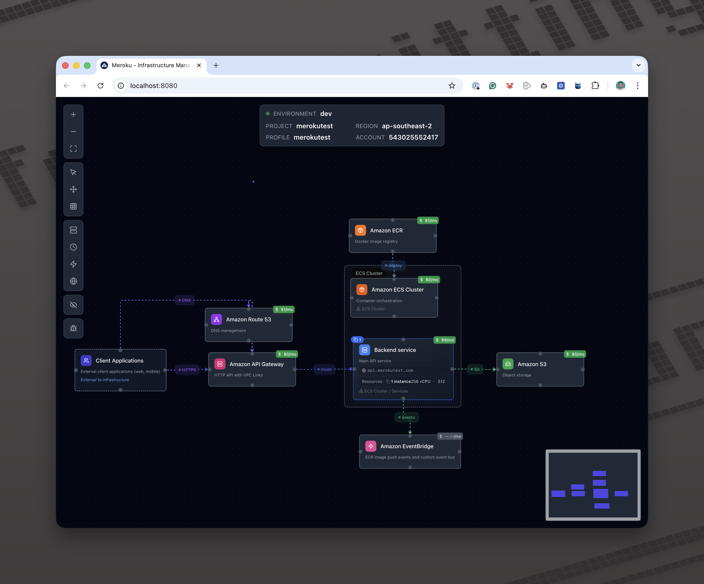
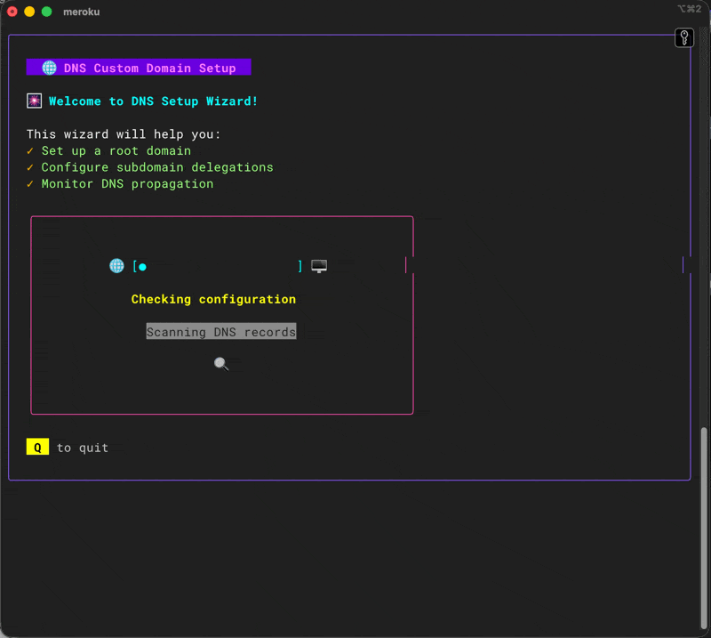

# Cloud Infrastructure as Code (IaC)

A comprehensive, production-ready AWS infrastructure toolkit that combines Terraform modules with intuitive management interfaces. Manage your entire cloud infrastructure through an interactive console menu, modern web editor, or direct Terraform commands.


## Features

- **Interactive Console Menu** - Beautiful TUI (Text User Interface) powered by Bubble Tea for guided infrastructure management
- **Web-Based Editor** - React+TypeScript visual editor for managing infrastructure configurations
- **DNS Management** - Automated cross-account Route53 zone delegation and domain setup
- **20+ Terraform Modules** - Production-tested modules for ECS, RDS, ALB, Cognito, Lambda, S3, and more
- **YAML-Based Configuration** - Simple, readable configuration using Handlebars templating
- **GitHub Actions Ready** - OIDC authentication and automated deployment workflows
- **Cost Optimized** - Smart defaults to minimize AWS costs (no VPC endpoints, optimized logging retention)

## Installation

### Homebrew (Recommended)

```bash
# Add the tap
brew tap MadAppGang/meroku

# Install meroku
brew install meroku

# Verify installation
meroku --version
```

### From Source

```bash
# Clone the repository
git clone https://github.com/MadAppGang/infrastructure.git
cd infrastructure

# Build the CLI
make build

# Run the CLI
./meroku
```

### Download Binary

Download the latest release from [GitHub Releases](https://github.com/MadAppGang/infrastructure/releases) for your platform.

## Quick Start

### Option 1: Interactive Console Menu (Easiest)

The console menu provides a guided experience for all infrastructure operations:

```bash
# Launch the interactive menu
meroku

# Navigate with arrow keys and enter to:
# - Set up DNS and domain delegation
# - Select AWS environment and profile
# - Generate Terraform configurations
# - Plan and apply infrastructure changes
# - View infrastructure status
```



### Option 2: Web Editor

For visual infrastructure management with live previews:

```bash
# Start the web editor
make web

# Open browser to http://localhost:3000
# - Edit YAML configurations visually
# - Preview generated Terraform
# - Manage environments side-by-side
```



### Option 3: Direct Commands

For CI/CD pipelines and advanced users:

```bash
# Generate Terraform from YAML
make infra-gen-dev

# Plan changes
make infra-plan env=dev

# Apply changes
make infra-apply env=dev
```

> 💡 **New to configuration?** Check out the [Environment Configuration Guide](./docs/ENVIRONMENT_CONFIGURATION.md) for detailed documentation on all available fields and options.

## DNS Management

Meroku includes comprehensive DNS management with automatic cross-account delegation.

### Interactive Setup

```bash
# Launch DNS setup wizard
meroku
# Select "DNS Setup" from menu

# The wizard will:
# 1. Create root zone in production account
# 2. Set up IAM roles for delegation
# 3. Create subdomain zones (dev.example.com, staging.example.com)
# 4. Configure NS records automatically
# 5. Update environment YAML files
```

### Command Line

```bash
# Check DNS configuration
meroku dns status

# Validate DNS propagation
meroku dns validate

# Remove subdomain delegation
meroku dns remove dev.example.com
```

### How It Works

- **Root Zone**: Created in production account (example.com)
- **Subdomain Delegation**: Automatic NS records for dev/staging environments
- **Cross-Account Access**: IAM role assumption for managing delegation
- **Auto-Configuration**: Environment files updated automatically

See [DNS Architecture](./docs/DNS_ARCHITECTURE.md) and [DNS Management Guide](./DNS_MANAGEMENT_INSTRUCTIONS.md) for details.

## Screenshots

### Console Menu
The interactive TUI provides guided workflows for common operations:

*Suggested screenshot: Main menu showing options like "DNS Setup", "Deploy Infrastructure", "Select Environment", "Generate Configuration"*

### Web Editor
Visual configuration editor with live Terraform preview:

*Suggested screenshot: Split view showing YAML editor on left, generated Terraform preview on right*

### DNS Setup Wizard
Step-by-step domain configuration:

*Suggested screenshot: DNS wizard showing domain input form and progress steps*

### Terraform Plan Viewer
Advanced diff viewer for infrastructure changes:

*Suggested screenshot: Tree view of resources with color-coded changes (create/update/delete)*

## Configuration

Infrastructure is defined using YAML files in the `project/` directory:

```yaml
# project/dev.yaml
env: dev
aws_region: us-east-1
aws_profile: myproject-dev

domain:
  name: example.com
  add_env_domain_prefix: true  # Creates dev.example.com

workload:
  name: myapp
  backend_cpu: 512
  backend_memory: 1024
  backend_desired_count: 2
  backend_autoscaling_enabled: true
  backend_autoscaling_max_capacity: 10

database:
  enabled: true
  engine: postgres
  instance_class: db.t3.small
  allocated_storage: 20

services:
  - name: api
    path: /api/*
    health_check_path: /health/live
    port: 8080
```

Generate Terraform from YAML:
```bash
make infra-gen-dev
```

📖 **For a comprehensive guide to all configuration fields, see the [Environment Configuration Guide](./docs/ENVIRONMENT_CONFIGURATION.md)**

## Architecture

The infrastructure includes:

- **Networking**: VPC with public/private subnets, NAT Gateway, Internet Gateway
- **Compute**: ECS Fargate for containerized services
- **Load Balancing**: Application Load Balancer or API Gateway
- **Database**: RDS Aurora PostgreSQL with automated backups
- **Storage**: S3 buckets with encryption and versioning
- **Authentication**: Cognito user pools and identity pools
- **DNS**: Route53 hosted zones with cross-account delegation
- **Monitoring**: CloudWatch logs and metrics (30-day retention)
- **CI/CD**: GitHub Actions with OIDC authentication

## Common Commands

```bash
# Infrastructure Management
make infra-init env=dev        # Initialize Terraform
make infra-plan env=dev        # Preview changes
make infra-apply env=dev       # Apply changes
make infra-destroy env=dev     # Destroy infrastructure
make infra-show env=dev        # Show current state

# Configuration Generation
make infra-gen-dev             # Generate dev Terraform
make infra-gen-prod            # Generate prod Terraform

# Development
make tui                       # Run console menu locally
make web                       # Run web editor
make build                     # Build CLI binary
make test                      # Run tests

# Version Management
./meroku --version             # Check current version
```

## Project Structure

```
infrastructure/
├── modules/          # Terraform modules (20+ AWS services)
├── env/             # Generated Terraform configurations
│   ├── dev/         # Development environment (generated)
│   └── prod/        # Production environment (generated)
├── project/         # YAML configuration files
│   ├── dev.yaml     # Development config
│   └── prod.yaml    # Production config
├── templates/       # Handlebars templates for generation
├── app/            # Go CLI application (meroku)
├── web/            # React+TypeScript web editor
├── scripts/        # Utility scripts
└── dns.yaml        # DNS configuration state
```

## Backend Scaling

Configure automatic scaling based on resource utilization:

```yaml
workload:
  # Resource allocation
  backend_cpu: 512              # CPU units (256, 512, 1024, 2048, 4096)
  backend_memory: 1024          # Memory in MB
  backend_desired_count: 2      # Initial instance count

  # Autoscaling configuration
  backend_autoscaling_enabled: true
  backend_autoscaling_min_capacity: 1
  backend_autoscaling_max_capacity: 10
  backend_autoscaling_target_cpu: 70      # CPU threshold %
  backend_autoscaling_target_memory: 80   # Memory threshold %
```

Scaling triggers:
- **CPU-based**: Scale when CPU exceeds target percentage
- **Memory-based**: Scale when memory exceeds target percentage
- **Request-based**: Scale based on ALB request count (when ALB enabled)

## Health Checks

All services must respond with HTTP 200 on:
```
GET /health/live
```

The load balancer marks unhealthy services for replacement if they fail health checks.

## Environment Variables

Backend services load configuration from **AWS Systems Manager Parameter Store**:

```bash
# Set parameters using AWS CLI
aws ssm put-parameter \
  --name "/myapp/dev/DATABASE_URL" \
  --value "postgres://..." \
  --type "SecureString"
```

Parameters are automatically injected as environment variables in ECS tasks.

## GitHub Actions Integration

The infrastructure includes OIDC authentication for GitHub Actions:

```yaml
# In your project's dev.yaml or prod.yaml
github_subject: "repo:OWNER/REPOSITORY:environment:production"
```

See [GitHub OIDC Documentation](https://docs.github.com/en/actions/deployment/security-hardening-your-deployments/about-security-hardening-with-openid-connect) for details.

## Remote Debugging

Execute commands in running ECS containers using AWS ECS Exec:

```bash
# Install AWS Session Manager Plugin (macOS)
curl "https://s3.amazonaws.com/session-manager-downloads/plugin/latest/mac_arm64/session-manager-plugin.pkg" -o "session-manager-plugin.pkg"
sudo installer -pkg session-manager-plugin.pkg -target /
sudo ln -s /usr/local/sessionmanagerplugin/bin/session-manager-plugin /usr/local/bin/session-manager-plugin

# Verify installation
session-manager-plugin

# Connect to container
aws ecs execute-command \
  --cluster my-cluster \
  --task task-id \
  --container container-name \
  --command "/bin/sh" \
  --interactive
```

Use the [ECS Exec Checker](https://github.com/aws-containers/amazon-ecs-exec-checker) script to troubleshoot connection issues.

## Event-Driven Deployments

Trigger deployments via AWS EventBridge:

```bash
# Manual deployment trigger
aws events put-events \
  --entries "Source=github,Detail=\"{}\",DetailType=DEPLOY,EventBusName=default"

# In GitHub Actions workflow
- name: Trigger Production Deploy
  run: |
    aws events put-events \
      --entries "Source=github,Detail=\"{}\",DetailType=DEPLOY,EventBusName=default"
```

## Cost Optimization

This infrastructure is designed for cost efficiency:

- **No VPC Endpoints**: Saves ~$27/month per endpoint (uses Internet Gateway instead)
- **Smart Log Retention**: CloudWatch logs retained for 30 days
- **Right-Sized Resources**: Sensible defaults for CPU/memory
- **Auto-Scaling**: Scale down during low traffic
- **Spot Instance Support**: (Optional) Use Fargate Spot for cost savings

## Best Practices

1. **Always test in dev first**: Run `make infra-plan env=dev` before production
2. **Use version control**: Commit all YAML configuration changes
3. **Review plans carefully**: Examine Terraform plan output before applying
4. **Enable autoscaling**: Let services scale based on demand
5. **Monitor costs**: Use AWS Cost Explorer to track spending
6. **Secure secrets**: Store sensitive values in Parameter Store with encryption
7. **Regular backups**: RDS automated backups are enabled by default

## Updating Infrastructure

Check for new features and improvements:

```bash
# Check current version
make version

# Update to latest version
make update

# Regenerate configurations
make infra-gen-dev

# Review and apply changes
make infra-plan env=dev
make infra-apply env=dev
```

**Note**: While we strive for backward compatibility, review changelogs before upgrading.

## Documentation

- [Environment Configuration Guide](./docs/ENVIRONMENT_CONFIGURATION.md) - Comprehensive reference for all YAML configuration fields
- [DNS Architecture Design](./docs/DNS_ARCHITECTURE.md) - DNS system design and cross-account delegation
- [DNS Management Instructions](./DNS_MANAGEMENT_INSTRUCTIONS.md) - Step-by-step DNS setup guide
- [CLAUDE.md](./CLAUDE.md) - AI assistant guidance and project conventions

## Getting Started Guide

### For New Projects

1. **Create infrastructure repository**:
   ```bash
   mkdir my-project-infrastructure
   cd my-project-infrastructure
   git init
   ```

2. **Download starter files**:
   ```bash
   curl https://raw.githubusercontent.com/MadAppGang/infrastructure/main/project/Makefile -o Makefile
   curl https://raw.githubusercontent.com/MadAppGang/infrastructure/main/project/dev.yaml -o dev.yaml
   ```

3. **Initialize**:
   ```bash
   make init
   ```

4. **Edit configuration**:
   ```bash
   # Edit dev.yaml with your project details
   vim dev.yaml
   ```

5. **Generate and apply**:
   ```bash
   make infra-gen-dev
   make infra-init env=dev
   make infra-plan env=dev
   make infra-apply env=dev
   ```

### For Existing Projects

Use the interactive console menu for guided setup:
```bash
meroku
```

Or the web editor for visual configuration:
```bash
make web
```

## Support

- **Issues**: [GitHub Issues](https://github.com/MadAppGang/infrastructure/issues)
- **Discussions**: [GitHub Discussions](https://github.com/MadAppGang/infrastructure/discussions)
- **Documentation**: See `docs/` directory

## License

See LICENSE file for details.

## Contributing

Contributions are welcome! Please:
1. Fork the repository
2. Create a feature branch
3. Make your changes
4. Submit a pull request

---

**Built with**: Terraform, Go (Bubble Tea), React, TypeScript, Raymond (Handlebars)
