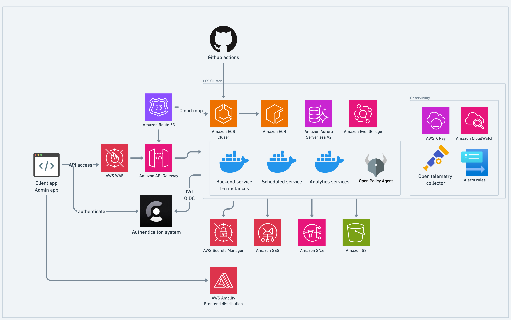

# Reference Cloud infrastructure (IaC)

This repository declares infrastructure of Gigit cloud as a code using [Terraform](https://www.terraform.io/).

## Dependencies

- Terraform v1.2.6
- AWS credentials for accessing Terraform state (hosted in S3 bucket)

1. Init Terraform:

```sh
    cd infra
    terraform init
```

Make sure your AWS CLI is configured for accessing `project-terraform-state` bucket, which hosts Terraform configuration.

2. Run and save terraform plan:

```sh
    terraform plan -out=plan.out
```

3. Apply when you're happy with the plan:

```sh
    terraform apply -out=plan.out
```

## Architecture




## Health check

All services by default should respond status `200` on GET handler with path `/health/love`. If it is not responding with status 200, the application load balancer will consider the service unhealthy and redeploy it. 


## Remote dubug

[You can use Amazon ECS Exec](https://docs.aws.amazon.com/AmazonECS/latest/developerguide/ecs-exec.html) to  execute command remotely in terminal.

To do so, you need to install [AWS Session Management Plugin](https://docs.aws.amazon.com/systems-manager/latest/userguide/session-manager-working-with-install-plugin.html#install-plugin-macos) on your machine.

For mac Mx you  need:

```shell
curl "https://s3.amazonaws.com/session-manager-downloads/plugin/latest/mac_arm64/session-manager-plugin.pkg" -o "session-manager-plugin.pkg"
sudo installer -pkg session-manager-plugin.pkg -target /
sudo ln -s /usr/local/sessionmanagerplugin/bin/session-manager-plugin /usr/local/bin/session-manager-plugin

```

After that you can verify the installation: `session-manager-plugin`.

With session manager you can login to container, execut a command in container or do a port forwarding.

You can use a [usefull script](https://github.com/aws-containers/amazon-ecs-exec-checker) to help you work with AWS Exec.


